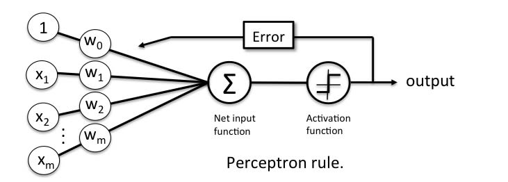
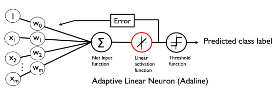

# Machine Learning and Neural Networks
Different projects made for learning.

# Description
*Some projects will need some cleaning,*
*README will be updated as well.*

**LowLevel_SLNN.ipynp:**
- Low level Single-Layer Neural Network
- Mathematical Symbols used in equations
- Learning Model Notes
- Iris Speciec Prediction:
- Load & Process Dataset
- Train & Predict Species
- Accumulate Accuracies
- Illustrate Species Distribution
- **The Perceptron Training Model:**
    - Fit-Method
    - Convergence
    - Convenience Function

- **Adaline (ADAptive LInear NEuron):**
    - Gradient Descent
    - Cost Function
    - Feature Scaling
    - Large-Scale Machine Learning 
    - Stochastic Gradient Descent

# Authors
[Byte Sensei](https://github.com/bytesenseidk)

# Version History
- 0.1:
  * Initial build
   
# Licence
This project is licenced under the Mozilla Public License 2.0 - see the [LICENCE](https://github.com/LarsRosenkilde/MusicPlayer/blob/master/LICENCE) for details
